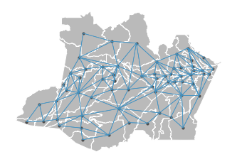

# Meshblock2Graph

This project generates a graph representation of spatial meshblocks based on distance or neighborhood.

> ## Setup

1. Create a **.env** file, insert an fill the following envirommental variables:

    ```` env
        ROOT_DATA= <path to save the data>
    ````

2. Create a  vitual enviroment and install all packages in requiments.txt.

    ```` bash
        conda create --name <env> --file requirements.txt
    ````

3. Install the project as package.

    ```` bash
        pip install -e .
    ````

> ## Usage

1. Configure the parameters in the files:

    ```` bash
    ├── data
        ├── parameters.json
        ├── switchers.json
    ````

2. Run src/main.py

    ```` bash
        python src/main.py
    ````

> ## Parameters description

Description of the parameters needed to execute the code.

>>### parameters.json

* **global**: General parameters
  * **region**: The name of the region (Ex: Brazil)
  * **org**: The name of the federal agency
  * **year**: The election year
  * **aggregation_level**: Geographical level of data aggregation
* **meshblocks**: parameters regarding the meshblock data
  * **data_name** The name of the data (Ex: meshblocks)
  * **url_data** The url folder to download the meshblocks
  * **filename** The donwloaded filename
  * **id_col** The identification column
  * **renamed_id_col**: The new name of the identification column [Optional]
  * **typee_adj** The type of graph (QUEEN or INVD)

>> ### switchers.json

* **meshblocls**: switchers regarding the locations pipeline
  * **raw**: switch to run the raw process (0 or 1)
  * **processed**: switch to run the processed process (0 or 1)

:warning: The switchers turn on and off the processes of the pipeline, by default let them all turned on (**filled with 1**), so the entire pipeline can be executed.

>## Final adjacenty matrix sample



## Project Organization

```` text
    ├── LICENSE
    ├── README.md          <- The top-level README for developers using this project.
    ├── requirements.txt   <- The requirements file for reproducing the analysis environment, e.g.
    │                         generated with `pip freeze > requirements.txt`
    │
    ├── setup.py           <- makes project pip installable (pip install -e .) so src can be imported
    ├── src                <- Source code for use in this project.
    │   ├── __init__.py    <- Makes src a Python module
    │   ├── data.py    <- Data abstract class
    │   ├── pipeline.py    <- Pipeline class
    │   ├── main.py    <- Main function
    │   │
    │   ├── census           <- Scripts to process census data
    │   │   └── raw.py
    │   │   └── interim.py
    │   │   └── preocessed.py
    │   │
    ├────
````

<p><small>Project based on the <a target="_blank" href="https://drivendata.github.io/cookiecutter-data-science/">cookiecutter data science project template</a>. #cookiecutterdatascience</small></p>
